**Table of contents:**
- [General Concepts and Phrases](#general-concepts-and-phrases)
- [Force](#force)
  - [ForcePoint](#forcepoint)
  - [(Something)ForceModel](#somethingforcemodel)
- [Water](#water)
  - [SimpleWaterQueryModel](#simplewaterquerymodel)
  - [Currents and Winds](#currents-and-winds)
    - [Static fields](#static-fields)
    - [Propeller fields](#propeller-fields)
    - [Field Visualization](#field-visualization)
- [Vehicle Components](#vehicle-components)
    - [Update rates](#update-rates)
    - [LinkAttachment](#linkattachment)
  - [Acoustics](#acoustics)
    - [Transceiver(TX)](#transceivertx)
      - [Occlusions](#occlusions)
      - [Propagation speed](#propagation-speed)
      - [Surface echoes](#surface-echoes)
      - [Bottom echoes](#bottom-echoes)
      - [Configuration](#configuration)
  - [Actuators](#actuators)
    - [Joints](#joints)
    - [VBS](#vbs)
    - [Propeller](#propeller)
  - [Sensors](#sensors)
    - [Battery](#battery)
    - [Camera Image](#camera-image)
    - [DepthPressure](#depthpressure)
    - [DVL](#dvl)
    - [GPS](#gps)
      - [GPSReferencePoint](#gpsreferencepoint)
    - [IMU](#imu)
      - [Accuracy tests](#accuracy-tests)
    - [Leak](#leak)
    - [Sonar](#sonar)
      - [Sonar Concepts](#sonar-concepts)
      - [Sonar Configuration](#sonar-configuration)
      - [Sonar Visualization](#sonar-visualization)
    - [Locked Direction Depth Sensor](#locked-direction-depth-sensor)
    - [Range Receiver](#range-receiver)
  - [ROS](#ros)
    - [Core](#core)
      - [RosMessages](#rosmessages)
      - [Clock](#clock)
      - [ROSPublisher](#rospublisher)
    - [Publishers](#publishers)
      - [TF](#tf)
    - [Subscribers](#subscribers)
      - [Teleporter\_Sub](#teleporter_sub)
      - [CurrentWP\_Sub](#currentwp_sub)
      - [Actuator Subscriber](#actuator-subscriber)
- [Utilities](#utilities)
  - [Rope](#rope)
    - [Rope Winch and Pulley](#rope-winch-and-pulley)
      - [Winch](#winch)
      - [Pulley](#pulley)
      - [RopeHook](#ropehook)
  - [Importer](#importer)
- [Prefabs](#prefabs)
  - [SAM AUV](#sam-auv)
    - [Keyboard Controller](#keyboard-controller)
    - [ROS Controls](#ros-controls)
  - [Quadrotor](#quadrotor)
    - [Keyboard controller](#keyboard-controller-1)
    - [Geometric Tracking Controller](#geometric-tracking-controller)
  - [GameUI](#gameui)
  - [WinchSystem](#winchsystem)
  - [Evolo](#evolo)
    - [Dynamics](#dynamics)
    - [Keyboard Controller](#keyboard-controller-2)
    - [ROS Controls](#ros-controls-1)
    - [LiDARs](#lidars)
    - [UnitySensor and UnitySensorRos packages](#unitysensor-and-unitysensorros-packages)
    - [Evolo Scene](#evolos-scene)


- [Developer Environment Setup](#developer-environment-setup)
  - [CSharp SDK and LSP Setup](#csharp-sdk-and-lsp-setup)


# General Concepts and Phrases
- **Body**: Refers to either an Articulation Body(AB), or a Rigidbody(RB) in Unity.
Since most of the time these two share the physical properties, we refer to them collectively as Bodies.

- **Standard**: The Standard Unity project found [here](https://github.com/smarc-project/SMARCUnityStandard)

- **HDRP**: The High Def. Rendering Pipeline Unity project found [here](https://github.com/smarc-project/SMARCUnityHDRP)


# Force
Simulation of water-related custom forces that are applied to Bodies.

## ForcePoint
A generalized massless point in space where external forces are applied.
This script is usually attached to many GameObjects and made child of a Body.
Most commonly used for approximate buoyancy forces, water currents and gravity.
For buoyancy and water currents, queries the [Water](#water) model to check for depth and current vector.

The more of these you put on a vehicle and the denser they are, the more accurate the forces will become.

Example:

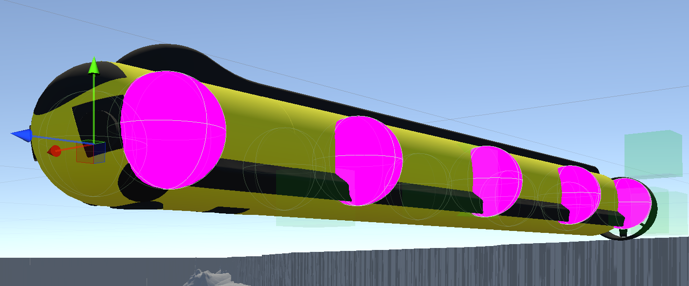

The force points are shown as magenta spheres.
They are children to the `base_link` object which contains a Body.

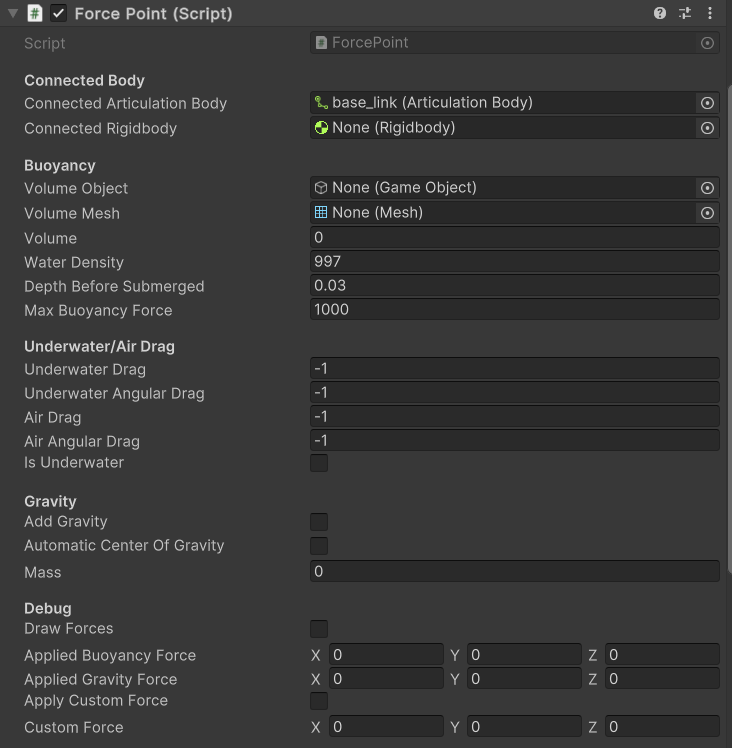

- Connected Body: Either an articulation body or a rigidbody can be assigned here. Usually the `base_link` of a robot.
- Buoyancy
  - Volume Object/Mesh: An object can be assigned to automatically assign the mesh from. Or a mesh directly.
  - Volume: Volume can also be set directly, if a mesh is not available.
  - Water Density: In Kg/m3, density of the fluid to calculate buoyancy forces from.
  - Depth Before Submerged: A workaround the fixed delta time simulation steps. When set to zero, the force points tend to produce high frequency oscilations. In one update it is in water and in the next it is out. To prevent this, some depth is allowed without applying the full buoyancy force. This smooths out the oscilations.
  - Max Buoyancy Force: A limit to keep physics from breaking.
- Underwater/Air Drag: If these values are set to anything except -1, the force points will set the corresponding drag values when the object is (partially) under the surface.
- Gravity
  - Add Gravity: If checked, this force point will add a gravity force as well.
  - Automatic Center of Gravity: If checked, the center of gravity of the object is calculated based on the locations of the force points it has. This can be useful when the object they are attached to has complicated geometry.
  - Mass: If gravity is to be applied, the mass of the entire object. The mass will also be distributed among the forcepoints, similarly to buoyancy forces.
- Debug
  - Draw Forces: Draws some debug lines for applied forces.
  - Applied X Force: Currently applied force as a vector.
  - Apply Custom Force: If checked, the vector below will be applied on every update.
  - Custom Force: A globally defined force vector to apply at this ForcePoint.


## (Something)ForceModel
An analytical model of a vehicle.
Since Unity only provides a rigid body simulation, some physical modelling (like hydrodynamic forces, damping) must be done "manually".
These "ForceModel" scripts do just that and are specific to the vehicle they model, such as SAM and BlueROV.


# Water
We do not simulate water as particles, but as vector fields and a surface.
[ForcePoint](#forcepoint)s are used to apply the appropriate forces.

## SimpleWaterQueryModel
Used to define an interface for any object within the Unity world to get the Y(height) value of the water surface at a given point.
While in Standard the water surface is a plane at a fixed Y, in HDRP water surface is simulated with waves and thus has different heights at different times and locations.

This is used for GPS fixes, pressure measurements, buoyancy forces and so on.

HDRP Water:

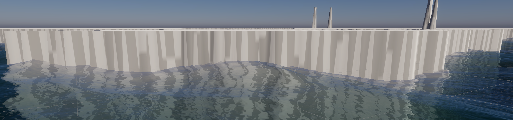

## Currents and Winds

### Static fields
A simple vector field within a volume that applies forces to any ForcePoints within it.
Used to simulate currents or winds within that volume.

4 current fields in the water visualized with Gizmos:

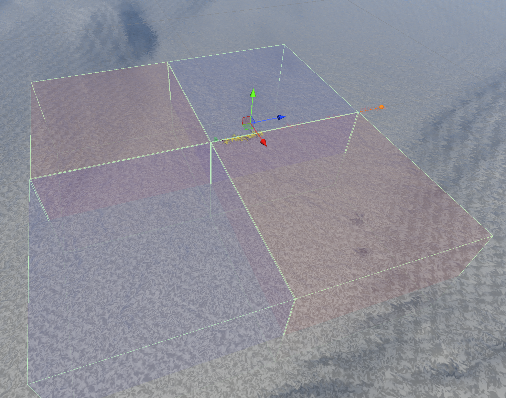

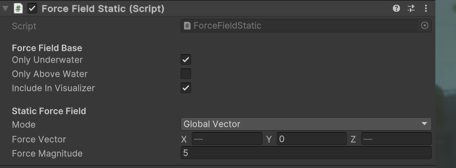

- **Only Underwater/Above Water:** If checked, the field will only apply on to ForcePoints that are under/above water.
- **Include In Visualizer:** Check if you want tiny swarms of game-visible particles 

### Propeller fields

Propellers should be pushing things in front of them as much as they push the thing they are attached to.
We use a conical mesh-collider to create this effect.
The magnitude of the force is inversely proportional with distance to object and proportional to the Propeller's applied force (`RPM * RPMToForceMultiplier`).
The `Cone Tip` acts as a simple repulsor with a variable magnitude.

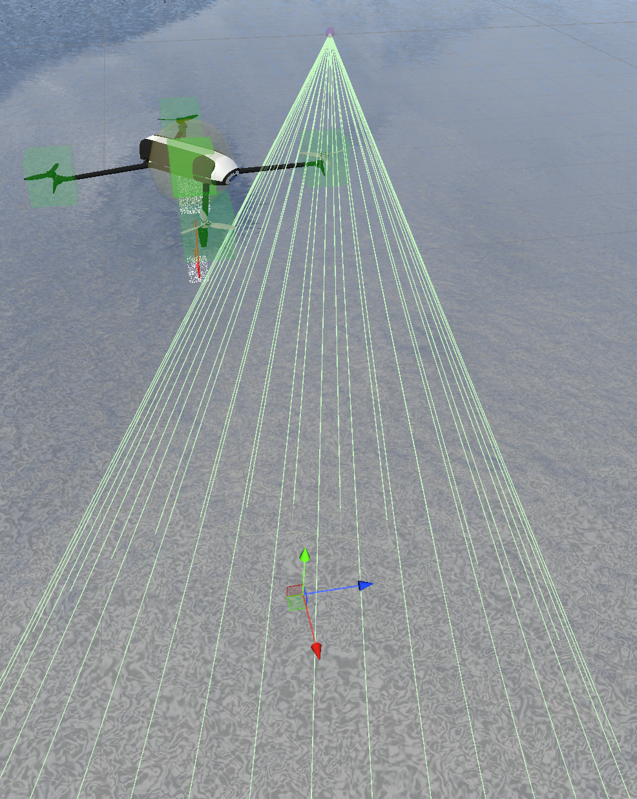

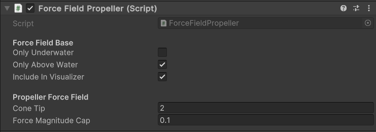

- Cone Tip: Adjust this to match the collider geometry. Sometimes it is desirable to apply forces inside the cone, but not right from its tip. The tip is visualized as a purple sphere gizmo.
- Force Magnitude Cap: Upper-limit of how much force the field will apply. Some drones require lots of force to float that maybe you might not want to apply to things below.


### Field Visualization

We use a pool of ForcePoints spawned within any field with a simple trail renderer to visualize the fields and their effect on any objects containing ForcePoints.

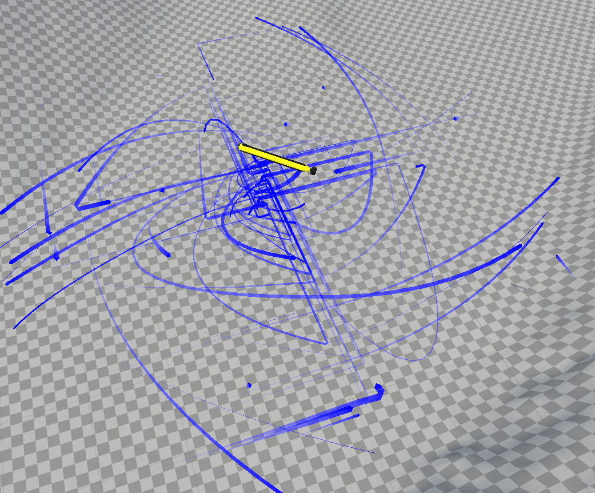


- ParticlePrefab: The prefab particle to spawn. This should contain a ForcePoint object and possibly some nice visual additions.
- Count, Lifetime: How many particles to keep around and for how long.
- Size: Given to the particle object to scale itself. For the default ForceFieldParticle, this is the radius of the ball.
- Recycle When Out: If checked, particles that leave the effect of any fields are re-spawned. This effectively keeps all particles within effect areas. However, if your fields are not overlapping, then you will not see "combined" effects of these fields.
- Spawn Strictly Inside: If checked, particles will be re-spawned until they are inside the effective volume. Otheriwise they are spawned inside the containing rectangular prism. If your fields are many and overlapping, keeping this unchecked would save you some performance. If your fields are very small, checking this would make them look better.

# Vehicle Components
These are the components that can be collected within a vehicle: usually sensors and actuators.
Optionally with ROS connections.
Most of them reflect real objects and some are abstractions.

- A general idea used for vehicle components is that the structure of the vehicle and its functional parts are defined separately within the robot object.
  - The structure part only contains geometry and Bodies, essentially reflecting a URDF file.
  - The functional parts are all agnostic to their poses, like a packaged real sensor, they can be mounted anywhere.

### Update rates
Unless specified separately, vehicle components that work with the physics engine (only few exceptions) use the `FixedUpdate()` method of Unity.
This means that the update rate of all of them is limited to the physics update rate of Unity, meaning by default they can be updated at 50hz maximum.
See [the unity documentation](https://docs.unity3d.com/ScriptReference/MonoBehaviour.FixedUpdate.html) for details.

### LinkAttachment
A base class that most sensors and actuators extend.

In general, we aim to keep the _function_ of a component and its _pose_ separete from each other: Many robots are defined with URDF files which only define a geometric structure of where everything is and connected to what.
These URDF files tend to change over the lifetime of a robot, a camera is moved elsewhere, some sensor is turned around, but the component itself does not change, only it's _pose_.

> Imagine the LinkAttachment mechanism as the ability to disassemble a robot on a table.
> Unlike reality, our robots can assemble themselves automatically at run-time :)

- A GameObject with a LinkAttachment component is given a string name in the editor.
- At `Awake()` this GameObject's parent is set to be the GameObject with the given name that is under the same root object.

> If you have written a new LinkAttachment-extending class, and need to use the `Awake()` method yourself, you need to call `Attach()` manually.
> See for example `Sonar.cs`.

For example, a Battery object. Before play mode, it is under `sam_auv_v1/SAMSensor`:


And at play mode, it is under `sam_auv_v1/odom/base_link/battery_link`:


- Rotate For ROS Camera: The camera origin is different in Unity and in ROS.
Checking this box ON rotates the LinkAttachment object to match the ROS standard.
- The Roll/Pitch/Yaw fields can be used to rotate the LinkAttachment object _after_ it is attached.
In general it is a better idea to modify the structure part of the robot (usually the URDF) instead of using this.


## Acoustics
Peer to peer acoustic communications.

### Transceiver(TX)
Simulates both a receiver and a transmitter of acoustic signals at the package level.
The main way to interact with a transceiver are its `Read()` and `Write()` methods.
- `Read()`: Returns a StringStamped object that was received first. Contains the data as a string, the time it was sent and the time it was received.
- `Write()`: Takes a string and puts it in the write-queue. The string is broadcast in the next `FixedUpdate()`, first-in-first-out.

We provide different levels of realism when simulating a transceiver:

#### Occlusions
We make use of sphere-casting to determine occlusions.
When a transceiver broadcasts, it performs a sphere-cast to _every_ other transceiver in the scene.
If the cast is free of obstacles, we consider that path free.
The required obstacle-free width can be configured.

#### Propagation speed
We use coroutines to simulate the propagation speed of sound.
If the path is clear and the target is within range, a coroutine is started: The target's `Receive()` method is called after a delay depending on the distance between the source and target.
This way, the delay can be timed accurately independently of simulation time steps.

This simulates the arrival timing of any packages and can be used for triangulation purposes.

#### Surface echoes
The most common source of echoes comes from the surface.
Since the physics involved in the production of echoes is too complex to be simulated at high rates, we approximate surface echoes as follows:

- Assume the surface is a plane defined by the horizontal position of the transceiver, the vertical position of the [Water](#water) model and the vector opposite gravity.
- Create a reflection of the transceiver around this plane.
- Sphere-cast from the reflection point to the target transceiver.
- Find the intersection of this ray and the plane. This is the "bounce point".
- Sphere-cast from source TX to the "bounce point" for occlusion check.
- Sphere-cast from "bounce point" to target TX for occlusion check.
- If no occlusions, find distance of source -> "bounce point" -> target.
- Check if distance is less than maximum range reduced by a configurable echo-loss.
- Start the [receiveing coroutine](#propagation-speed) with the in-direct distance.

```
                  O' selfReflectionPos
                  |\
                  | \
 water plane ~~~~~~~~E~~~~~~~~ E=echoPoint
                  | / \
                  |/   \
          selfPos O     T targetPos
```

> This method allows us to use only 3 raycasts per pair to create surface echoes, so it can be enabled without much concern about performance.


#### Bottom echoes
The second-most common source of echoes.
Unlike surface echoes, a flat-bottom assumption is harder to justify for the bottom, since sheer walls, crevices, rocks and other similar non-smooth objects can create such echoes.

We implement the following "shotgun" approach:
- Sphere-cast from the source TX towards equidistant points on a bottom-half-dome.
- For all non-occluded rays, sphere-cast a reflected version.
- Find intersection of reflected rays and a horizontal plane at the Y-position of the target TX.
- For all non-occluded rays, check the distance between reflection-ray-hits and the target TX.
- If any are within a configurable range, find the closest.
- Use the distance of source -> "bounce point" -> target for the [receiveing coroutine](#propagation-speed).

> This method uses many raycasts to determine a path and should be enabled with caution.
> The number and pattern of rays are configurable by passing a mesh to the transceiver. The vertices of the mesh will be used for bottom echoes.

> Note that this method uses a terrain object with a terrain collider as the source for its bottom and considers everything else as occlusions. Any bottom features that you expect echoes from should be part of the terrain and not separate objects.

#### Configuration

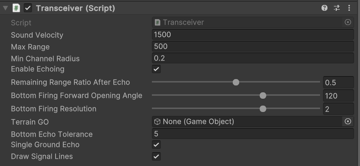

- Sound Velocity: Used for propagation delays.
- Min Channel Radius: The minimum size of an opening to be considered occlusion-free between the source and target TXs. For sphere-casts, the radius of the sphere.
- Enable Echoing: Toggles bottom and surface echoes.
  - Remaining Range Ratio After Echo: Echoes absorb energy that affect the max range of a ping. After a bounce, how much of a pings energy is left to travel further.
  - Bottom Firing Opening Angle: The angle of the cone where bottom-echoes will have their rays fired within. The wider this is, the more likely far-away surfaces will produce a bounce.
  - Bottom Firing Resolution: The number of subdivisions on the half-dome. Determines the number of rays cast for bottom-echoes. The bigger, the more accurate, but also heavier on the CPU.
  - Terrain GO: The _terrain_ object bottom echoes will bounce from.
  - Bottom Echo Tolerance: On the horizontal plane of the target, how close do we allow bounced-rays to come to accept as a "hit". The larger, the more likely a bottom echo will reach targets but also less accurate to real life.
  - Single Ground Echo: Toggle bottom echoes separately.
- Draw Signal Lines: Toggle drawing debug lines for all the rays cast.


## Actuators
Scripts that control articulation bodies using drives defined within.
See [Unity Articulation Bodies](https://docs.unity3d.com/Manual/class-ArticulationBody.html) documentation for details on how these work.

The general idea:
- Actuator script exposes a public method to set all of its relevant variables.
- Some kind of controller (Keyboard, ROS, Internal, etc) calls these methods when relevant.
- In `FixedUpdate()` the actuator sets the Arti. Body properties.

> Optionally, actuators can implement `IROSPublishable` (See [IROSPublishable](#ros)) if they are expected to provide feedback to ROS.


### Joints
These are all straight interfaces to the AB's drives.

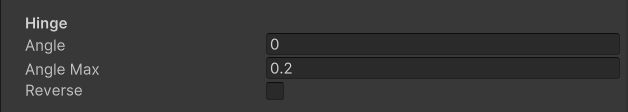

- **Hinge**: Rotates the body around an axis with some force in both directions.
  - **Angle(Max)**: Current and maximum angles of the hinge.
  - **Reverse**: Check to reverse direction.

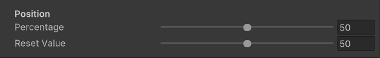

- **Prismatic**: A piston. Moves the body along an axis.
  - **Percentage**: How much of the piston is extended.
  - **Reset value**: The value to set when signalled "reset". Usually the result of a homing sequence on the real thing.


### VBS
A tank that can fill up and empty itself.
Changes its AB's mass.


- **Percentage**: How much of the tank is full.
- **Reset value**: The value to set when signalled "reset". Usually the result of a homing sequence on the real thing.
- **Max Volume_l**: Total fluid volume of the tank.
- **Density**: Density of the fluid stored.

### Propeller
A set of propeller blades.
Spins at a given RPM and applies torque and thrust.
Can be used underwater and in the air for a drone.

Example configs:

AUV                                 |Drone
:----------------------------------:|:---------------------------------------:
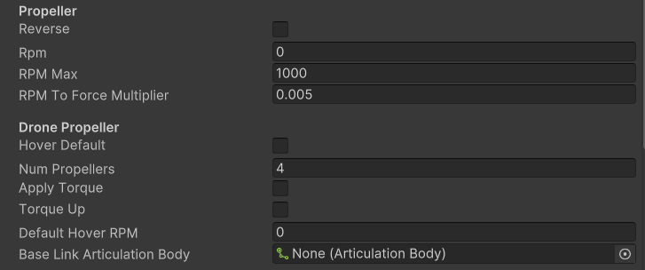|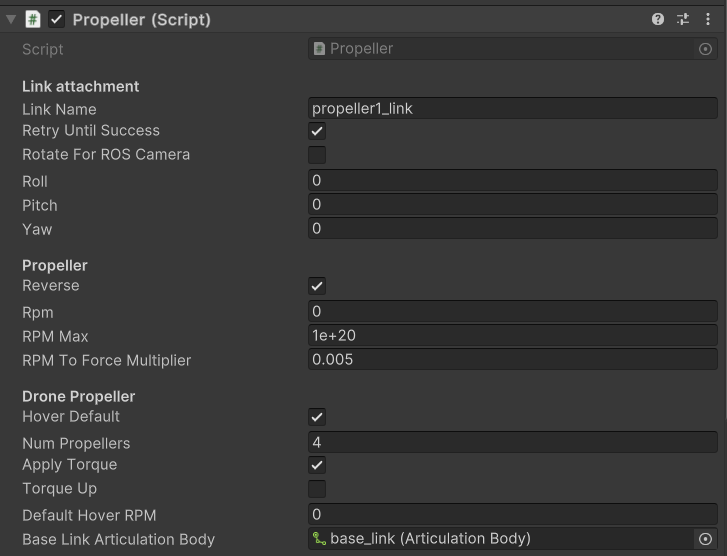

- **Hover Default**: If checked, the propeller will use `Num Propellers`, the mass of the `Base Link Articulation Body` and the `RPM To Force Multiplier` values to calculate the RPM required to keep the assigned `Base Link Articulation Body` afloat and set it when the game starts.
  - This is useful to allow a drone to start in the air already.
  - This assumes all the propellers are pointing towards the ground straight.
- **RPM To Force Multiplier**: This is a property of the propeller itself. We set it to 0.005 here arbitrarily.


## Sensors

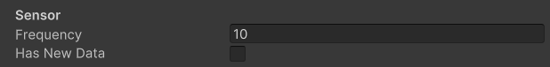

- **Sensor**: The base class of most sensors. Handles the update frequencies.
  - **Frequency:** Frequency of sensor updates. Limited to a period of Unity's `Time.fixedDeltaTime`. Reading the world faster than it changes produces duplicate readings. If faster sensors are desired, the physics update rate should be increased. See [Unity Simulation Time](https://docs.unity3d.com/ScriptReference/MonoBehaviour.FixedUpdate.html) for details.
  - **Has New Data:** A boolean set by individual sensors to signal an outside component that the sensor has been updated with a new reading. Useful for sensors that output something only when they detect a change.
- **Noise**: All sensors are perfect unless otherwise specified.

### Battery
A simple battery that discharges over time.
Discharge is linear between min and max voltages.

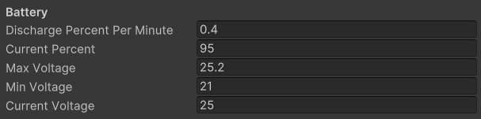


### Camera Image
A camera sensor that renders an attached Unity camera onto a texture.
This texture can be displayed within Unity or published into ROS.

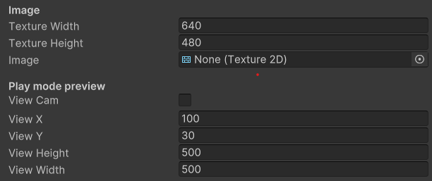

- **Play mode preview**: The image can be displayed within Unity game window if the checkbox is checked. The location and size of the preview is configurable.


### DepthPressure
Measures depth using water pressure.
Uses [a water query](#water) to find real depth, then converts that to KPa.

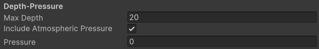

- **Max Depth**: If the sensor is deeper than this, it will report the maximum depth it can.
- **Include Atmo. Pressure**: If checked, the reported pressure will include 1Atm constant pressure.


### DVL
Approximates a DVL raycast beams.
- Does a raycast for each beam.
- If some number of rays hit, considers this a bottom lock.
- If bottom lock
  - Reads velocity from the attached body.
  - Casts a 5th beam straight down for altitude.
  - Reads the ranges of each ray.

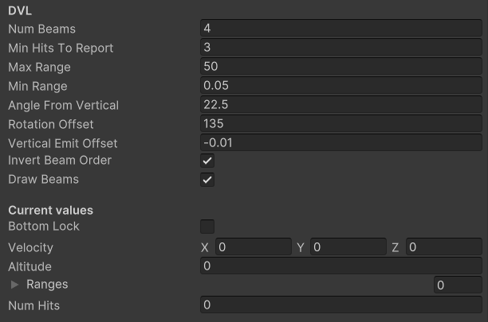

- **Num Beams**: The number of beams on the DVL can be configured. Most use 4.
- **Min Hits To Report:** How many hitting rays do we consider to be a bottom lock.
- **Angle From Vertical:** The angle of an imaginary line in the middle of all the beams from the vertical axis of the sensor.
- **Rotation Offset**: The angle around the imaginary middle line of each beam. Use to arrange the beams. Where should the 1st beam be in relation to the sensor frame?


### GPS
A GPS antenna.
Uses [a water query](#water) to determine submersion and does not update if submersed.

Since Unity does not have a model of the globe, we must identify a position in Unity coordinates as a global position.
GPS uses this reference point to calculate its relative position in UTM coordinates, then converts the UTM coordinates into Lat/Lon as its output.

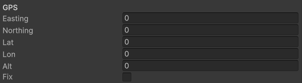

- **Fix**: Filled by the sensor when it is above water.

#### GPSReferencePoint
Provides every GPS object in the Unity scene a global reference point.
We usually attach this to geo-referenced objects, like a terrain scan with known coordinates.
The global position can be given in Lat/Lon or UTM coordinates.

There must be exactly one such script in a scene.

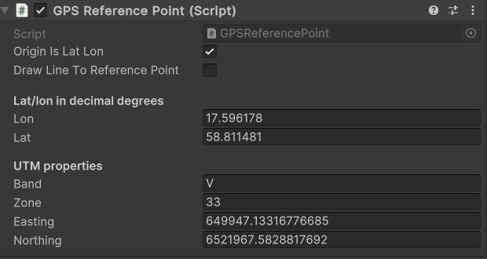

- **Origin is Lat Lon**: If checked, the Lat/Lon fields are used to calculate the UTM fields and vice-versa.
- **Draw Line To Reference Point**: If checked, each GPS object will draw a line to the origin defined here. Can be useful to see sometimes.


### IMU
A simple Inertial Measurement Unit that measures linear and agular velocities and accelerations of its attached body.
Accesses the velocity fields of its attached body.
Accelerations are calculated from ground truth velocity differences at every update.

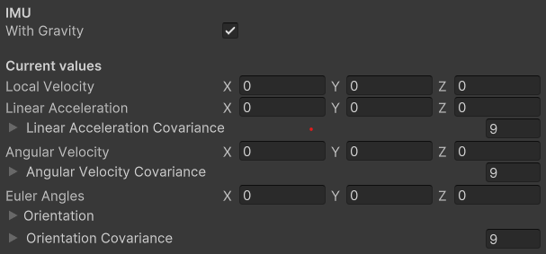

- **With Gravity**: If checked, IMU will add the gravity vector to its output.

#### Accuracy tests
The IMU has been tested for accuracy with this method:

- A floating rigidbody cube with 1 unit of mass and no drag is created.
- A 1 unit force is applied to the stationary cube for a fixed period of time.
- A 1 unit of force is applied in the opposite direction for the same amount of time after the first application is done.
- The cube should have 0 velocity.
- During this process, the accelerations of the cube as reported by the IMU are integrated into velocities with a simple ROS node.
- The final velocity reported by the ROS node should also be 0.

The above test is implemented here:
- https://github.com/KKalem/smarc2/tree/sim_imu_testing
- https://github.com/KKalem/SMARCUnityStandard/tree/sim_imu_testing
- https://github.com/KKalem/SMARCUnityAssets/tree/sim_imu_testing

To run it yourself:
- Pull the above branches.
- Run `smarc2/scripts/imu_tester.py`
- Run the game from the scene `SMARCUnityStandard/Assets/Scenes/Dev/IMUTester.unity`
- Plot `accel_tester/data`, `imu_test/linear_acceleration/y` and `odom_test/twist/linear/y`.
  - `data` and `linear/y` should overlap entirely and form a triangle.

This is not merged into master since the result is... boring. **The IMU is accurate.**


### Leak
A very simple boolean sensor.
Does not simulate anything.
Can be "triggered" from the editor.

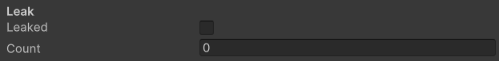

- **Leaked**: Check manually while the game is running to trigger.
- **Count**: Number of updates (defined by Frequency field of Sensor) where "Leaked" was checked.


### Sonar
We simulate sonars using many raycasts.
To keep the simulation running smoothly, these raycasts are done in parallel so thousands of rays can be used without slowing down the simulation.

Most of the parameters and their semantics are shared between different types of sonars:

SideScanSonar(SSS)                  |ForwardLookingSonar(FLS)
:----------------------------------:|:---------------------------------------:
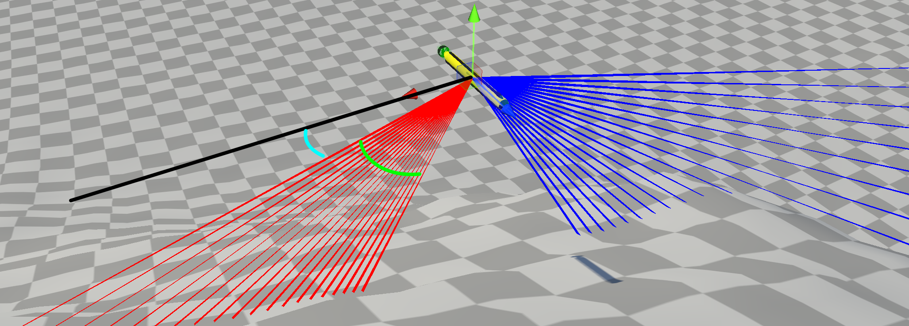          |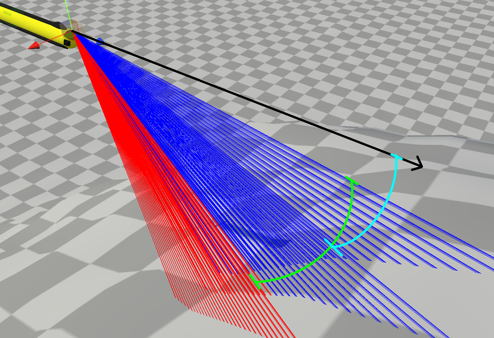

#### Sonar Concepts

- **Type**: The type of sonar, one of
  -  Multi-beam echo-sounder(**MBES**)
     -  Emits a single beam of rays with a configurable breadth and reports back distances and angles to produce a point cloud of hits.
  -  SideScanSonar (**SSS**)
     -  Emits two beams at configurable tilt and breadth and reports back only distances hit.
  -  Forward-looking sonar (**FLS**)
     -  Emits many beams forward at configurable tilt, breadth and FOV and reports back distances and angles to produce a point cloud of hits.
- **Beam**: A beam is a cone (or a slice of one) shaped volume where sound travels. Applicable to all sonar types. Red (Starboard) and blue (Port) bundles of lines are each a beam.
- **Beam Breadth**: The opening angle of the conical beam. From one straight edge to the opposite one. All sonar types use this. The neon green angle on the red beam of SideScanSonar.
- **Tilt**: The angle from the horizontal plane to the nearest part of a beam. Always positive. Usually used with MBES and SSS. The cyan curve between the black horizontal plane and the red beam in both SSS and FLS images.
- **FOV**: Field of View. The side-to-side angle around the vertical axis of many beams. Usually used with an FLS. Neon green
- **Rays**: Raycasting vectors. Approximation of sound propagation. Usually in the order of hundereds per beam. Placed equidistantly within a beam. Individual red or blue lines.


#### Sonar Configuration

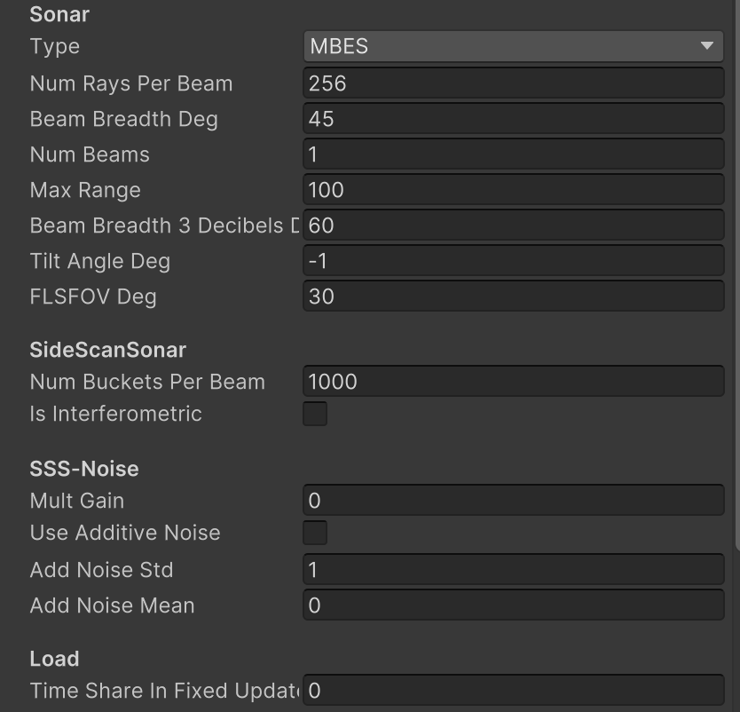

- **Beam Breadth 3 Decibels Deg**: While the raycasts are done equidistantly, not all angles have the same return intensities. This is the -3dB return angle. Should be less than beam breadth.
- **SideScanSonar**: These are used only if Type == SSS.
  - **Num Buckets Per Beam**: While a SSS can use thousands of rays, it usually reports a fixed number of distance buckets. This is that fixed number. Rays will be consolidated by their hit distances into these buckets.
  - **Is Interferometric**: If checked, the SSS will also report angles in addition to distances. This allows a point cloud to be generated.
- **SSS-Noise**: These are used only if Type == SSS.
  - **Mult Gain**: The return intensities of the rays will be multiplied by this gain.
  - **Use Additive Noise**: If checked, noise will be added to the hit distances of the rays.
    - **Add Noise Std/Mean**: The additive noise is sampled from a Normal distribution with this std. and mean.
- **Load**: Ratio of time taken within one `Time.fixedDeltaTime` by the `FixedUpdate()` method of Sonar. If this value is above 1, simulation will become very sluggish.

#### Sonar Visualization

For all sonars, we can visualize the points that rays hit with colorful lines:

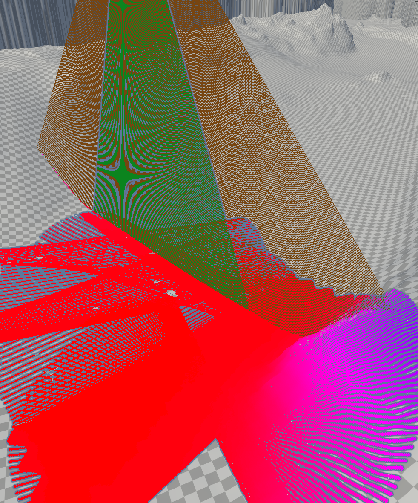

Simply add the component `GameUI/RayViewer` to a sonar and check in its config what you want visualized:

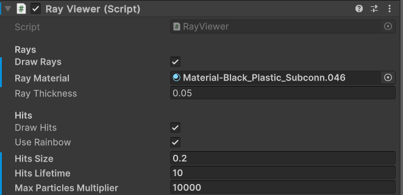

- **Draw Rays/Hits:** Toggle drawing of this data type. If not ON at start, can not be turned on during game. But can be toggle freely if ON at start.
- **Ray Material:** Assign a material to be used for the rays. Maybe something shiny or transparent?
- **Ray Thickness / Hits Size**: How thicc do you want your lines/quads to be.
- **Use Rainbow**: Should the hits be colored according to where they are inside the `[minHeight, maxHeight]` range? If off, they will be red.
- **Hits Lifetime**: How long, in seconds, should the particles for hits stay around. Limited by Max Particles Multiplier!
- **Max Particles Multiplier**: How many copies of each hit should be kept on the scene? If you have 256 rays for a MBES, setting this to 100 will result in 25600 particles. Limited by Hits Lifetime!

### Locked Direction Depth Sensor
A sensor that estimates the depth of an object by raycasting in a given direction and measuring the distance to the first surface hit or, if no surface is hit, by using the water level as a fallback. The sensor adds Gaussian noise to simulate real-world inaccuracies. The depth is measured from the current position of the sensor relative to the water level or surface hit.

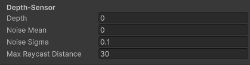

- **Max Raycast Distance**: The maximum distance the raycast will check for a surface in the specified direction.
- **Noise Mean**: The average (mean) value of the Gaussian noise applied to the depth measurements, used to simulate inaccuracies in depth readings.
- **Noise Sigma**: The standard deviation of the Gaussian noise to control how much the measurements fluctuate.
- **Water Query Model**: This sensor uses a water query system to determine the water level when no raycast hit occurs.
- **Sensing Direction**:  The direction in which depth is sensed.

---

### Range Receiver
This sensor calculates the distance between a sender object and the receiver. If the sender object is within a predefined range, the distance is calculated and Gaussian noise is added to simulate sensor inaccuracy. If the distance exceeds the range, the sensor reports an infinite distance, indicating no signal.


- **Range**: The maximum distance within which the sensor can detect the sender object.
- **Sender Object**: The object from which the distance is being measured. The sensor calculates the distance between the sender and itself.
- **Noise Mean**: The mean value of the Gaussian noise added to the distance measurement, used to simulate real-world inaccuracies.
- **Noise Sigma**: The standard deviation of the Gaussian noise to add variability to the distance measurement.


## ROS
We use a the [main-ros2 branch of the ROS-TCP-Endpoint](https://github.com/Unity-Technologies/ROS-TCP-Endpoint/tree/main-ros2) forked here: [ROS TCP Endpoint](https://github.com/KKalem/ROS-TCP-Endpoint) into the humble branch to match the rest of the repositories.

More info can be found [here](https://github.com/Unity-Technologies/Unity-Robotics-Hub/blob/main/tutorials/pick_and_place/2_ros_tcp.md)

The main configuration from the Unity side is the IP:Port settings, found under Robotics->Ros Settings in the Unity editor.

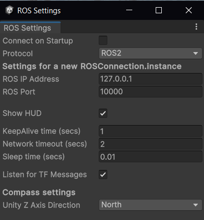

- **Connect on Startup**: Check if you want Unity to attempt to connect to the Endpoint when you press play. If the Endpoint is not running, this will keep throwing warnings.
- **Protocol**: Pick ROS2. While there is nothing stopping you from trying ROS2, all the messages we have distributed are for ROS2, meaning you would need to re-generate all the ROS messages yourself.
- **ROS IP/Port**: If you are running Unity in the same machine as your Endpoint, the defaults of 127.0.0.1 and 10000 will work. If you are running the Endpoint on a VM or a different machine on the same network, you need to put that machine's IP:Port here.
- **Show HUD**: If checked, shows the IP address and connection status in the game window. Might be obstrusive. Has no other effect.
- **Keepalive, timeout, sleep times**: Network connection settings. Defaults are good.
- **Listen for TF Messages**: Keep checked. Unless TF information in Unity is not desired.
- **Unity Z Axis Direction**: Keep the default North. Z is forward in Unity, and also North. This coincides with X forward and North of ROS well.

### Core
The core namespace includes things that require extensive knowledge of ROS itself, such as clocks, TimeStamps, Publisher class and ROS Messages.
In most cases, you should not need to think about these beyond using them if you implement new subs/pubs.

We have modified [the example found here](https://github.com/Unity-Technologies/Robotics-Nav2-SLAM-Example/tree/main/Nav2SLAMExampleProject/Assets/Scripts) for Clock and TF.

#### RosMessages
Where we keep all compiled C# versions of the ROS Messages in [smarc2/Messages](https://github.com/smarc-project/smarc2/tree/humble/messages).

The compilation is done from Unity by following Robotics->Generate ROS Messages.

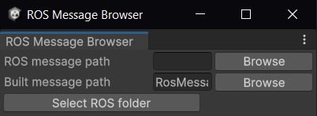

- **ROS message path**: Browse to where your ROS messages are defined. You can select a large parent folder as well. The window will show you the discovered ROS messages/services/actions that it can compile into C#. See the next image.
- **Built message path**: This is a path within the _project_. Unfortunately you can not pick a path inside an assets package. So you will need to _move_ this folder's contents to `SMaRCUnityAssets/Runtime/Scripts/VehicleComponents/ROS/Core/RosMessages` after generating them!

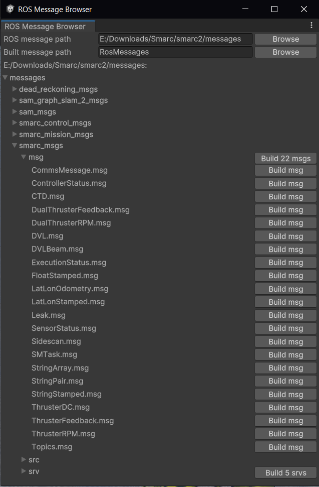

- **Build msg**: Clicking this will compile the ROS message into C# in the selected folder. For example, for `CommsMessage.msg`, this will create `RosMessages/smarc_msgs/msg/CommsMessageMsg.cs` which can be used from a Unity script with `using RosMessageTypes.Smarc`.

#### Clock
Publishes the in-game clock since the game has started into the `/clock` topic.

Any simulation-interacting ROS node should be setting `use_sim_time=true` in their launch and access the time with `secs, nanosecs = node.get_clock().now().seconds_nanoseconds()`.

The reason for publishing clock separately from system time is that the simulation could be faster or slower than real time, thus any node that relies on time must be aware of this discrepency.

#### ROSPublisher
Base class of most publishers.
Handling of publishing frequency, topic and namespacing is done here.

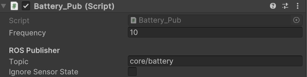

- **Frequency**: Independent of the sensor that it is publishing and `Time.fixedDeltaTime`, the publisher can be set to an arbitrary frequency. While it won't stop you from publishing faster than the physics updates, this is probably not going to be useful.
- **Topic**: If the topic does not start with `/`, then it is treated as relative, otherwise it is treated as absolute. If relative, then the name of the _root_ object will be prepended to this topic. For example if there is an object in the Unity object hierarchy `sam0/SAMSensors/Battery` with topic `core/battery` the final topic will be `/sam0/core/battery`.
- **Ignore Sensor State**: If checked, the topic will be published at the given frequency and topic regardless of the sensor having any updated data. Uncheck if your sensor only produces a message when it has measured something new.

### Publishers
These  publishers are named as `{SensorName}_Pub` to make it clear in the editor which is which.

Publisher | Message type
:----|----:
AcoustiveReceiver_Pub | **smarc_msgs/StringStamped**
Battery_Pub | sensor_msgs/BatteryState
CameraImage_Pub | sensor_msgs/Image
CameraImageCompressed_Pub | sensor_msgs/CompressedImage
CameraInfo_Pub | sensor_msgs/CameraInfo
DepthPressure_Pub | sensor_msgs/FluidPressure
DVL_Pub | **smarc_msgs/DVL**
GeoPoint_Pub | geographic_msgs/GeoPoint
GPS_Pub | sensor_msgs/NavSatFix
IMU_Pub | sensor_msgs/Imu
Leak_Pub | **smarc_msgs/Leak**
Odometry_Pub | nav_msgs/Odometry
PercentageFeedback_Pub | **smarc_msgs/PercentStamped**
PropellerFeedback_Pub | **smarc_msgs/ThrusterFeedback**
SonarPointCloud_Pub | sensor_msgs/PointCloud2
SSS_Pub | **smarc_msgs/Sidescan**

> Notice that there are some publishers that do not have a corresponding sensor, like `Odometry_Pub`. These are mostly there for convenience or ground truth information accessibility from ROS.

#### TF
While the above publishers are all used by attaching to a game object with the corresponding sensor/actuator, the TF Tree is a little more involved.
It **does not** extend the base `ROSPublisher` class.

ROS Transform Tree Publisher can be attached to an otherwise empty game object under the desired robot.
It is a `LinkAttachment` where the attached link (`odom`) in the image below will be the root of the tree published by this publisher.
The script will travel down the object hierarchy and publish the relative poses of all object with a `URDF Link` component.
**Objects without this component are ignored by the TF Tree.**

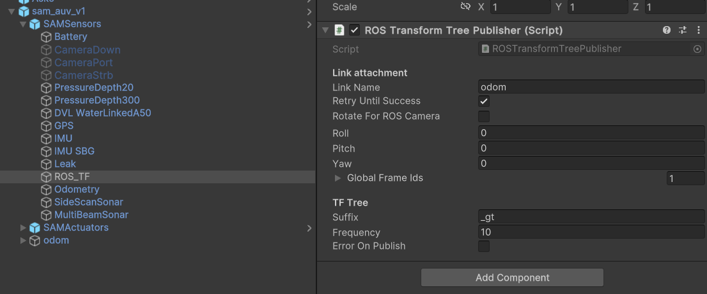

- **Suffix**: This string will be added to the end of _every single TF_ published by this.
- **Global Frame Ids**: Usually "map". The map frame in Unity refers to the origin of the simulation. Since Unity uses floats for its transforms, we can not set up a simulation in a global reference frame like UTM. Thus all simulations must be in a local map frame. To get around this limitation and still produce global positioning (like for example a GPS sensor) we use a [GPS Reference Point](#gpsreferencepoint).


### Subscribers
Similar to publishers, these are all suffixed `_Sub`.

Subscriber | Message type
:----|----:
AcousticTransmitter_Sub|**smarc_msgs/StringStamped**
HingeCommand_Sub|**sam_msgs/ThrusterAngles**
PercentageCommand_Sub|**sam_msgs/PercentStamped**
PropellerCommand_Sub|**smarc_msgs/ThrusterRPM**
Teleporter_Sub|geometry_msgs/Pose
TFtoUnity_Sub|tf2_msgs/TFMessage
CurrentWP_Sub|**smarc_mission_msgs/GotoWaypoint**

- TFtoUnity_Sub is explained more in the [GUI Section](#gameui).

#### Teleporter_Sub
This component will teleport the attached object according to a Pose from ROS.
Useful when you want to move an object around from ROS, either to modify a scene from ROS, or repeat an experiment or even use a Unity object as a simple way to visualize something in ROS.

All velocities of the object will be set to 0 after teleportation.

Nothing else is modified, such as Articulation drives, poses etc.


#### CurrentWP_Sub
A simple component AND prefab that displays a circle and line to visualize a waypoint in a robot might be moving towards.
Updates visuals on every message.

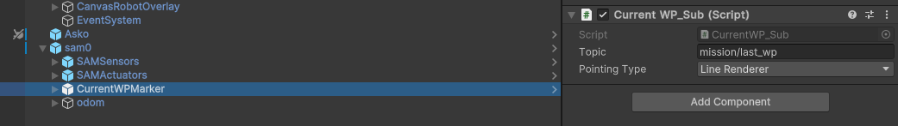

- **PointingType**:
  - Position: The position of the object will be changed to reflect the waypoint. You should add a visual element to the object for this to make sense.
  - LineRenderer: A circle with radius `goal_tolerance` and center `lat,lon` and a line from 2m above water to the same center will be drawn in the world without moving the object around. See image below.

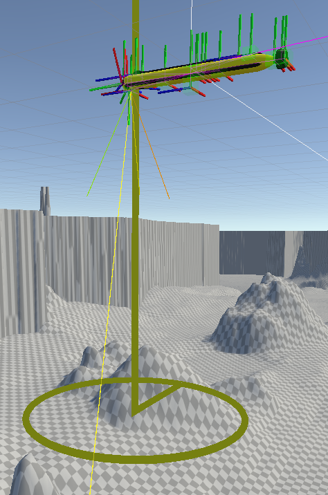


#### Actuator Subscriber
Subscribers that control an actuator usually derive from this class, they are usually named `{actuatorName}Command_Sub`.

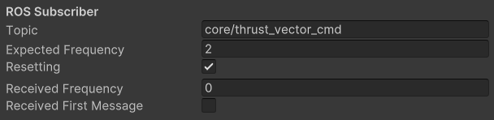

- **Expected/Received Freq.**: The frequency of messages expected by the acutator to work properly. Some actuators reset if no command is given.
- **Resetting**: Set by the subscriber when `ReceivedFreq < ExpectedFreq`. If resetting, the actuator that this subscriber controls is told to reset to its default value. See [actuators](#actuators).
- **Received First Message**: Set by the subscriber when it has received at least one message.


# Utilities
We have some useful things that make life easier when developing a vehicle or a scenario.
These are mostly intended to be used by scene creators to produce prefabs and objects for later use and will likely will never have a game UI parallel.


## Rope

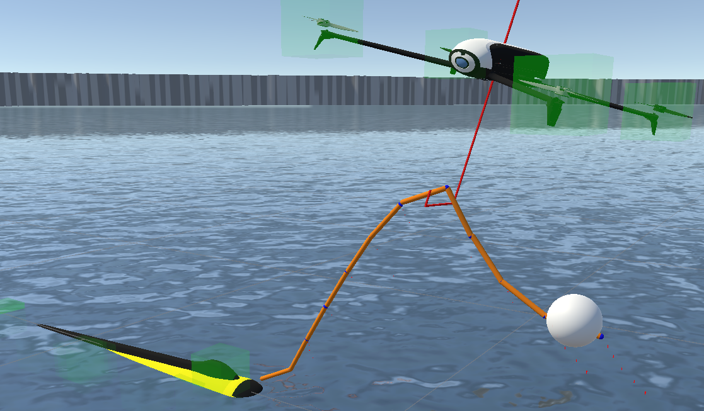

We simulate a rope using a chain of rigid bodies.
This allows us to have per-segment physical properties, like buoyancy, damping, mass etc. to allow visually-accurate motion of the rope when it is partially underwater.

> This many-segment rope looks nice, but is not physically accurate!

Putting this rope under tension will cause stretching and eventually erratic behaviour.
For systems that handle tension, see [this section](#rope-winch-and-pulley) on winches and pulleys.

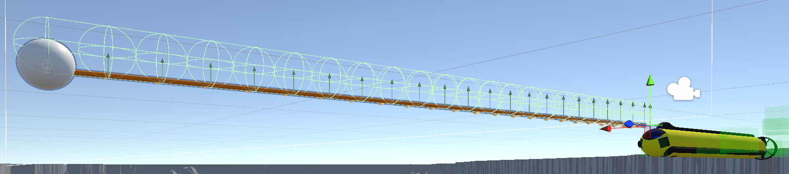

To create a rope, you can use the rope generator.

This component
- generates a rope that is attached to the robot by default.
- can be added to any part of a robot.
- sets the specific parameters of the generated rope.
- can generate a buoy at the end of the rope.

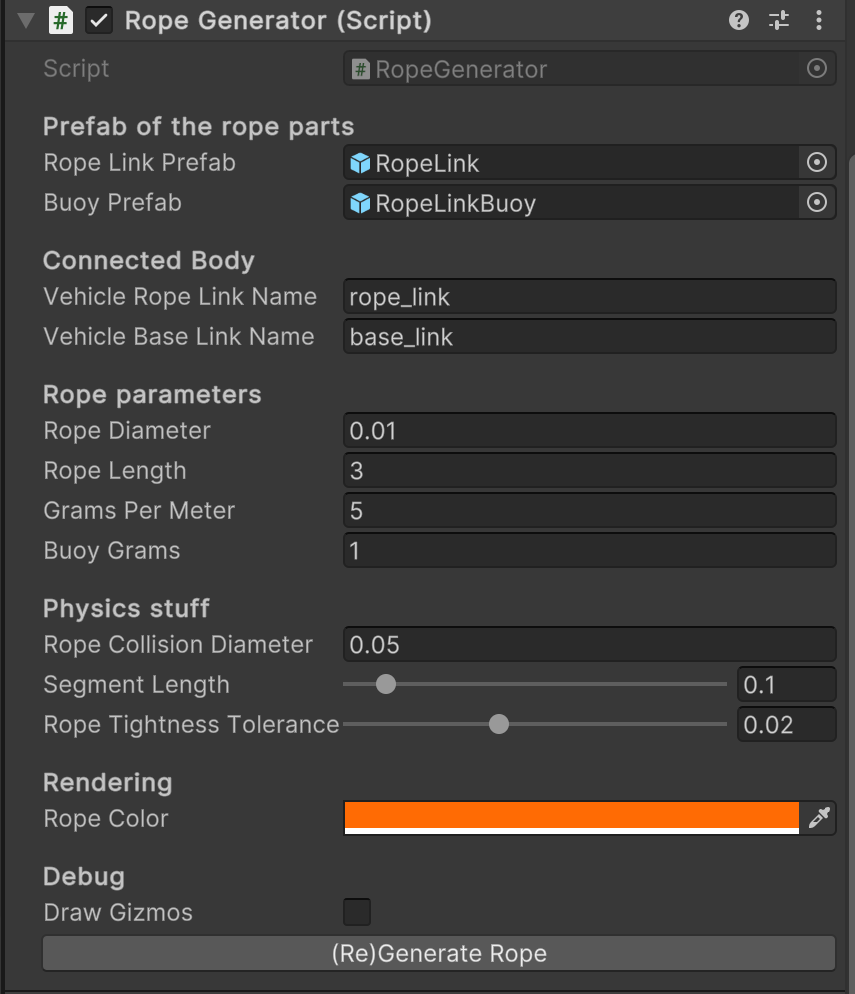

- **Prefab of the rope parts**
  - **Rope Link Prefab**: The prefab that will be used for each link in the rope chain.
  - **Rope Buoy Prefab**: The prefab of a buoy to attach at the end of the rope.
- **Connected Body**
  - **Vehicle Rope link Name**: Similar to a [link attachment](#linkattachment), the rope will be jointed to this part of the robot.
  - **Vehicle Base Link Name**: The base_link of the vehicle the rope is attached to. The "Rope" object will be created as a child here.
- **Rope Parameters**
  - **Rope Diameter/Length**: Thickness and total length of the rope. The rope is generated straight.
  - **Grams Per Meter**: How heavy the rope is. Each link will be assigned a mass according to this.
  - **Buoy Grams**: How heavy a buoy at the end of the rope will be. If 0, no buoy will be created.
- **Physics Stuff**
  - **Rope Collision Diameter**: Small things moving fast makes collision checks very difficult. To go around this limitation, we use a separate size for just the collisions. The collision geometry will be tangent to the visual geometry at the "bottom" and grow from there. This way if the rope is hanging somewhere, it looks visually accurate despite the collisions being unnaturally large.
  - **Segment Length**: Length of each rope link segment. The total length will be divided by this to determine the number of segments. Be aware that more segments usually means that the physics engine will explode when forces get bigger.
  - **Rope Tightness Tolerance**: The individual rope segments will color their gizmos red/green if they are tight or not, towards both the buoy and the vehicle.
- **Rendering**
  - **Rope Color**: You can pick any color for your rope.
- **Debug**
  - **Draw Gizmos**: If checked, rope will visualize some stuff as gizmos.
- **(Re)Generate Rope**: This will create an object called `Rope` as a child of the object the component is attached to and place all the rope links in there. If the `Rope` object exists, it will delete it and re-create it with the currently set parameters.

A rope link prefab must contain this component:


- **Spring/Damper/Max Force**: The rope links are connected by configurable joints with drives. These parameters control the spring system between each link. Playing with these parameters can make a rope stiffer or slacker.


### Rope Winch and Pulley

The many-segment rope system above does not work (usually) when under tension.
But sometimes, an articulation body system (like a drone) might need to carry another articulation body system (like a submarine) by catching a piece of rope attached to the load.

**Common assumptions**

- The rope is visualized as a line. It is assumed that most of the time, these components will be used while the rope is under tension.
- The color of the line is red when the load is applying force to the rope (tense) and green when the rope is not carrying the load (slack).
- The rope allows some stretch. Very rigid ropes are possible, but simulation stability will suffer.
- The rope parts are created at runtime.
- Rope has no collision
- Ropes have 0.1 mass, 1 Drag, 1 Angular Drag and 1e-6 Inertia.


#### Winch

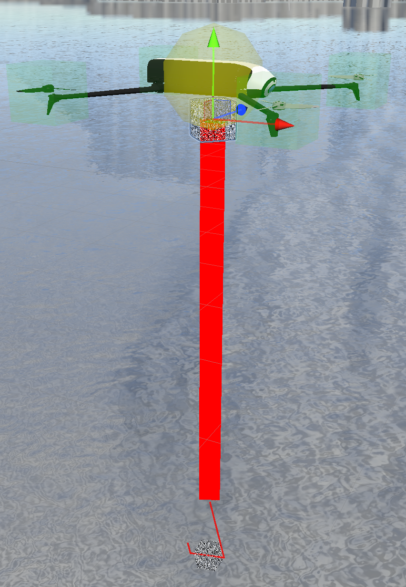

A length-adjustable rope.
In the picture above, the red hook is attached to the selected cube with a Winch.
The cube is the "winch body" that is attached to the drone with a fixed joint.

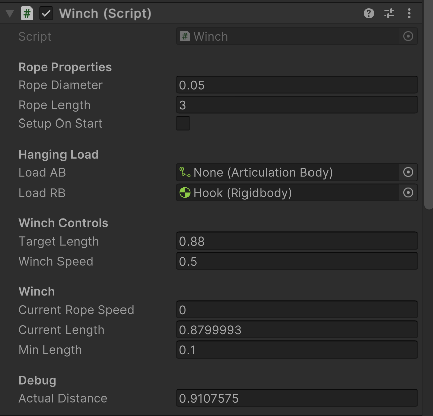

- **Rope Properties**
  - **Rope Diameter**: Just visual thickness
  - **Rope Length**: Total length of the rope. Target Length will be limited by this.
  - **Setup On Start**: If checked, the rope will be created and connected when you press play.
- **Hanging Load**
  - **Load AB/RB**: The load that will be attached to the end of the rope.
- **Winch Controls**
  - **Target Length**: The winch will spool up or down the rope to get the extended rope to this length.
  - **Winch Speed**: How fast the winch spools. Rate of change in length.
- **Winch**
  - **Current Rope Speed/Length**: Read-outs.
  - **Min Length**: To keep the load from hitting the carrier.
- **Debug**
  - **Actual Distance**: Distance between Winch and Load. If under tension, usually a little bigger than Current Length.

#### Pulley

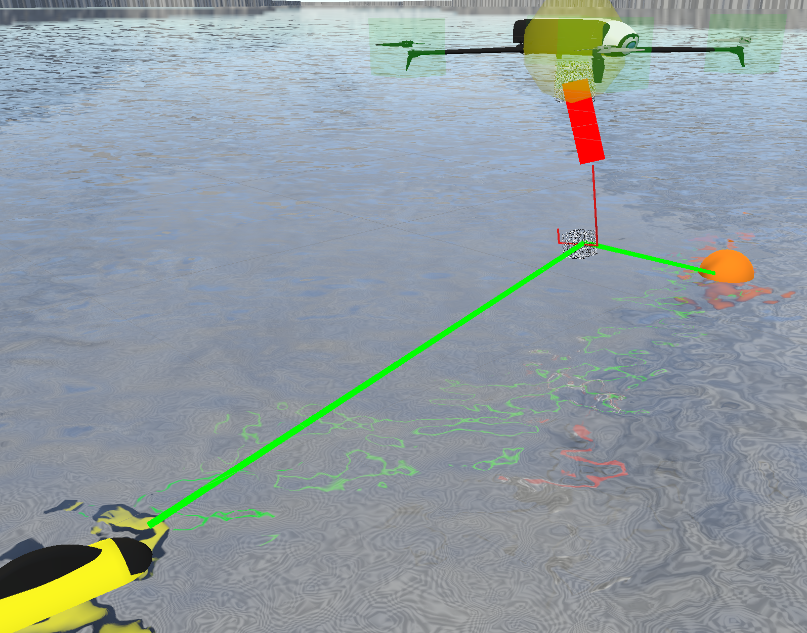

When a rope is "plucked" by a hook, it creates a pulley system where the two loads connected by the rope will balance around.
In the picture above, SAM and the buoy are connected through the green rope, over the red hook.
The "Pulley" object is shown as a cube with a funny texture.

The pulley works by effectively using two winches attached to each load.
The speed of the rope over the hook (towards load one or two), is determined by the force they apply on the joints of the rope.
This allows the pulley to behave kind of realistically in the presence of drag, inertia and momentum.


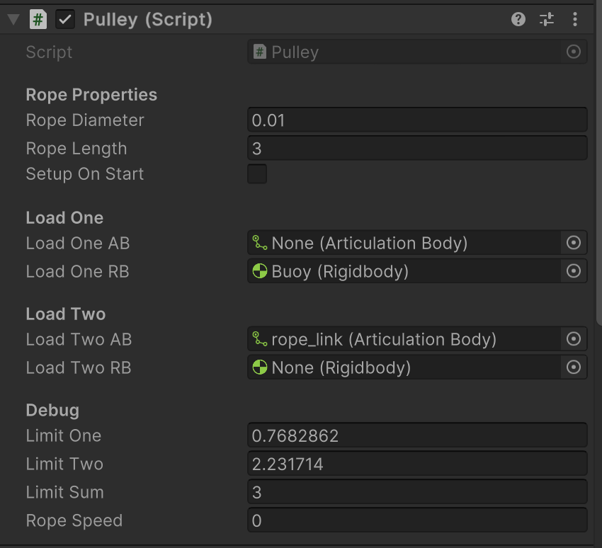

- **Rope Properties, Load One, Load Two**: Same as [Winch](#winch)
- **Debug**:
  - **Limit One/Two**: The individual limits of each load
  - **Limit sum**: To make sure the sum matches the length of the rope.

#### RopeHook

The RopeHook script manages the lifecycles of a hook that is suspended by a winch and carrying a pulley.

> You should start by using [the prefab](#winchsystem).

The expected usage of the RopeHook is such:
- A hook that is suspended on a winch is lowered towards a visual rope.
- The hook collides with the RopeLink.
  - Hook replaces the visual rope with a [pulley](#pulley) that connects the two ends of the rope.
- Hook winch is raised to the top.
  - This usually leads to a collision between hook and buoy.
- On collision with buoy (signifying that the pulley is all the way towards one side) the heavier load (SAM) is attached to the same winch the hook is.
  - Buoy, Hook and Pulley (and their components) are destroyed.
- The end result is a winch carrying the heavy load.
  - This is the most stable joints can get, since there is exactly 3: Winch to carrier, winch to rope, rope to load.
- Carrier can now carry away the load, lower it, raise it etc.


## Importer

URDF into Unity, JSON out of Unity

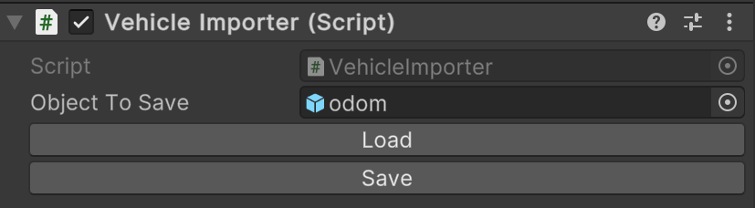

[URDF Importer docs](https://github.com/Unity-Technologies/URDF-Importer)


# Prefabs

## SAM AUV

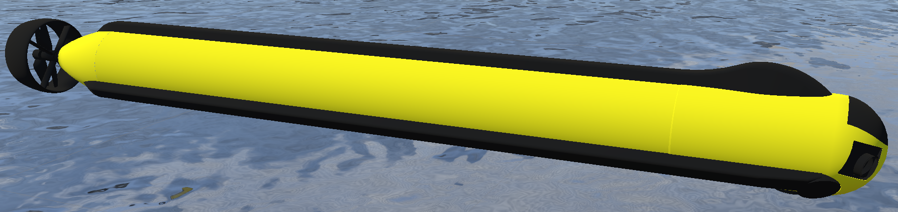

We have implemented the AUV that we have developed in the SMaRC Project in the simulator, available as a prefab under `SMARCUnityAssets/Runtime/Prefabs/sam_auv_v1`

### Keyboard Controller

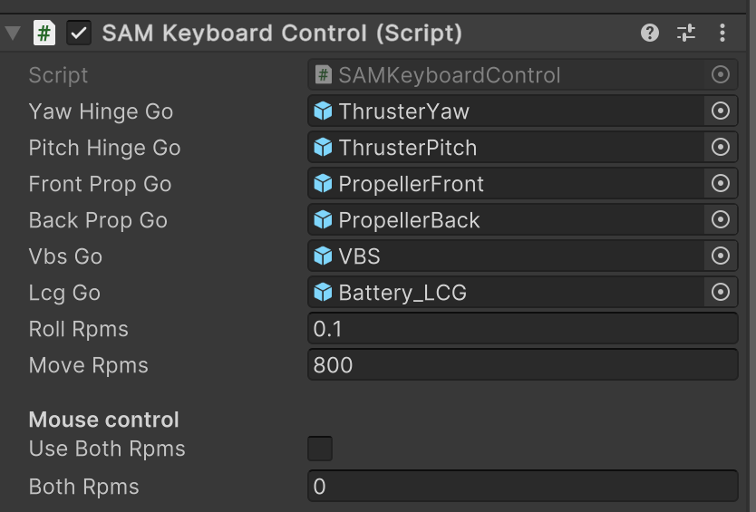

- **Keys**:
  - **W,A,S,D** controls the thrust vector.
  - **Up/Down arrows** controls thrust.
  - **R,F,C** sets the VBS to 0%, 50%, 100% full respectively.
  - **T,G,V** sets the LCG to 0%, 50%, 100% forward respectively.
- **XXX Go**: No need to modify these unless you add sme new actuators that you'd like to control.

### ROS Controls

All of SAM's actuators and sensors have ROS subs/pubs implemented so SAM is completely controllable through ROS topics.
The topics can be found in the [sam messages package of the smarc2 repository here](https://github.com/smarc-project/smarc2/blob/humble/messages/sam_msgs/msg/Topics.msg)


## Quadrotor

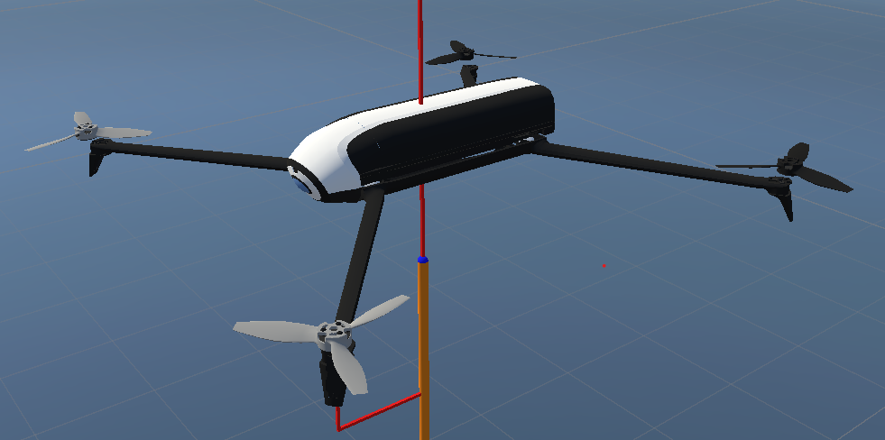

We have implemented a simple quadrotor drone, available as a prefab under `SMARCUnityAssets/Runtime/Prefabs/Quadrotor`.

### Keyboard controller

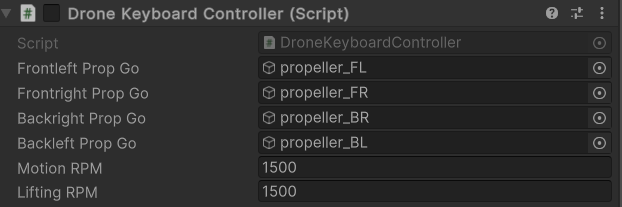

- **Keys**:
  - **I,J,K,L** for horizontal motion.
  - **U,N** for up/down.
  - **Space** for "Lifting mode" that makes the other keys apply a different RPM difference.
- **XXX Prop Go**: The four propellers, probably never need to be touched.
- **Motion RPM**: The RPMs to add/remove to hovering RPMs when moving normally.
- **Lifting RPM**: Extra RPMs over the motion RPMs when pressing *Space* and a direction key.

### Geometric Tracking Controller

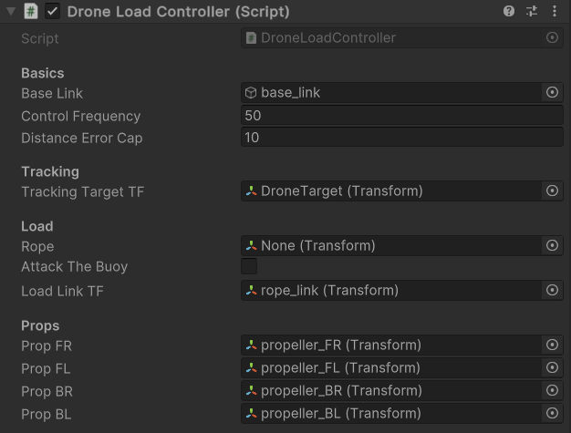

- **Base Link**: Base link of the drone itself.
- **Control Freq.**: Frequency of control inputs, set to `FixedUpdate()` frequency for best results.
- **Distance Error Cap**: Limit the aggressiveness of the drone motion. The bigger this is, the more aggressively the drone will tilt to propel itself directly at the target.
- **Tracking Target TF**: An object to track. This can be literally anything. The drone will control towards this object. By default the quadrotor prefab has a `DroneTarget` object that you can use. You can move this around in the editor while the game is running or move it any other way, like from ROS using [the teleporter](#teleporter_sub).
- **Load**: This controller can also control for a suspended load.
  - **Rope**: The rope object that the load is suspended with.
  - **Attack The Buoy**: If checked, the drone will ignore Tracking Target TF above and instead go for the buoy of the rope.
  - **Load Link TF**: The transform where the rope's base is attached. Usually a part of another robot.


## GameUI
We have a very rudimentary UI for game mode, to change some settings easier while the sim is running.
This is provided as a prefab under `SMARCUnityAssets/Runtime/Prefabs/GUI/GameUI`.

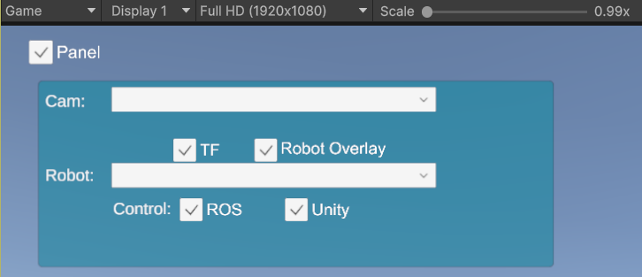

- This is designed for a 1080p game window. While it will work on other resolutions, it will probably look bad. You can set your game window to 1080p at the top bar.
- **Panel**: Uncheck to hide the entire thing.
- **Cam**: Cameras in the scene are listed here. You can change which one is rendered on the game window here.
  - Cameras under `GameUI` have the same control scheme as Unity editor's cameras: *Right click* to look around. While holding *right click*, *WASD* to move around and *QE* to move up/down.
- **TF**: If checked, and there is a ROS TF Publisher/Subscriber in the scene, it will be visualized as colored arrows in the game window.
- **Robot Overlay**: If checked, objects tagged "#robot" will have their names displayed on the scene with small arrows, overlaid on their position on screen.
- **Robot**: Objects tagged "#robot" will be listed here. The chosen one will have the following controls:
  - **ROS/Unity**: Checking ROS will disable any keyboard controllers the robot might have to allow control through ROS while checking Unity will disable any [ActuatorSubscriber](#actuator-subscriber)s and enable the keyboard controllers. These two can not be checked at the same time.

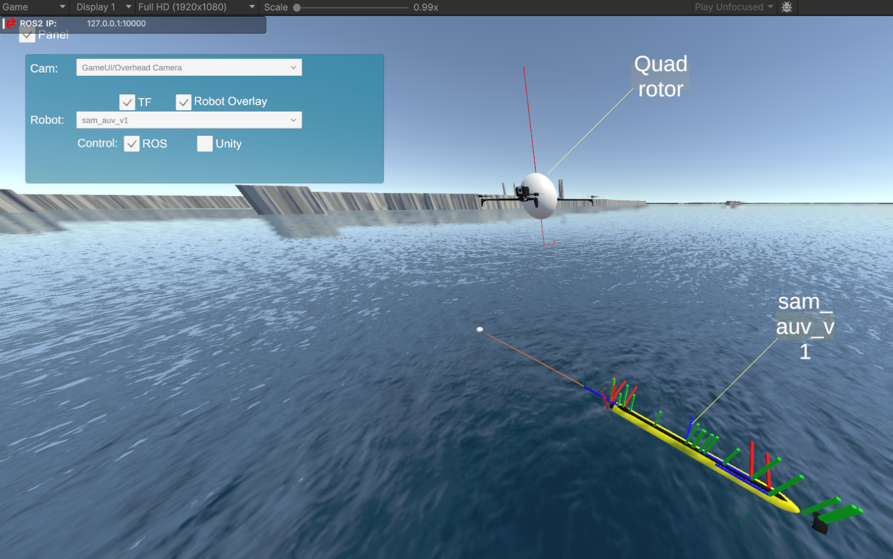

- The names of the robots are displayed with yellow lines and background
- The TF Tree of SAM is displayed with colored arrows.

## WinchSystem
Found under: `SMARCUnityAssets/Runtime/Prefabs/Components` and is a part of [the Quadrotor prefab](#quadrotor).

A simple prefab that implements the [winch-pulley-hook setup](#rope-winch-and-pulley).
You need to assign:
- The carrier body to `WinchToHook`'s FixedJoint.
- The loads of `PulleyToLoads`

after instantiating one of these to use it.

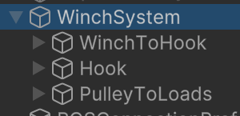


## Evolo

<p align="center">
  
  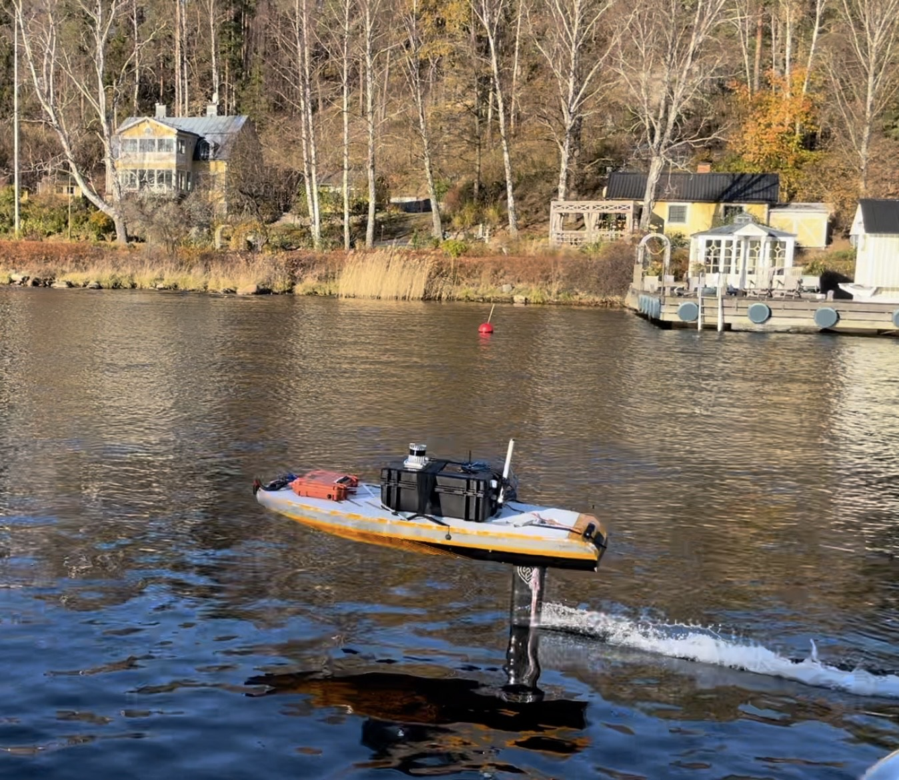
</p>


[Evolo](https://www.youtube.com/watch?v=qcnbFDZcgbc&ab_channel=JakobKuttenkeuler) is an autonomous hydrofoiling craft, belonging to the Maritime Robotics group at KTH. [Jakob Kuttenkeuler](https://www.kth.se/profile/jakob) is responsible for the project. 
It is currently a stable platform that can be controlled either by following predefined waypoints or by an Rc controller. The mid-term goal is for it to have more autonomy, for example being able to detect and avoid obstacles.

This vehicle was implemented in the simulator and its prefab is available under `SMARCUnityAssets/Runtime/Prefabs/Evolo.prefab`

<p align="center">
  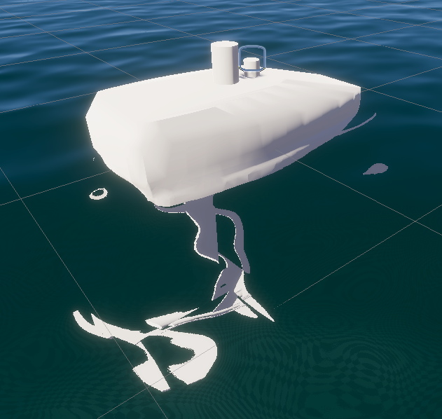
  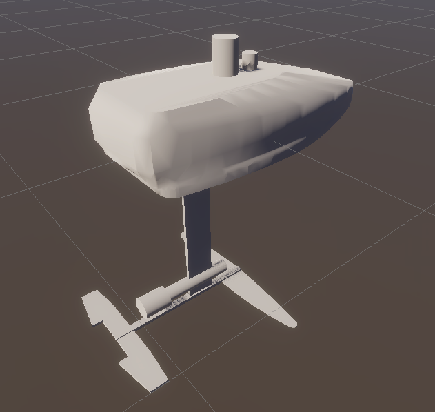
</p>

Watch this prefab moving around its Unity scene on Youtube:

[](https://www.youtube.com/watch?v=zDlfj2JRouk&list=PLS_kAMaDCf60yKCstIyLDDcZ6xkmtSgXz&ab_channel=AlexandreReis)


The implementation of Evolo can be controlled with the parameters:

- Goal for linear speed (knots)
- Goal for roll angle (degrees)

These are the same parameters used when the real Evolo is controlled with an RC controller.

In order to change these 2 parameters you have 3 options:
- Use keyboard arrows 
- Change Unity inspector’s variables directly
- Publish a ROS topic of name “/evolo_cmd”

### Evolo's inspector window

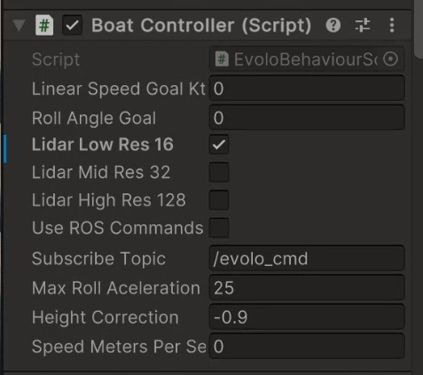


### Collisions

Evolo is a kinematic rigid body with box colliders defined around it's geometry.
Currently, it can collide with other objects, but it does not simulate collisions. This is because the sim assumes that the speed of the vehicle is not affected by colliding with other objects.

### Dynamics
In this implementation of Evolo, the Unity physics engine is not used. Instead, we simulate the dynamics of the vehicle directly. Its dynamics constraints are applied to a kinematic rigid body. Let's understand what are those dynamic constraints and definitions:
- **Speed** - The vehicle's speed is constrained to:
  -  **[-3, 0] knots**: Reverse or stationary.
  -  **[8, 13] knots**: Cruising speed.
  -  Speeds WITHin **[0, 8] knots** can only occur when acceleration to cruising speed or braking to fully stop. The real vehicle is not stable and has poor maneuverability within these speeds

- **Roll angle** roll only happens for speeds between 8-13knots. The maximum roll is 13 degrees.
-  **Yaw rate** is calculated given that the vehicle does coordinated turns. This means that the yaw rate is directly proportional to `tan(Roll Angle)` and the inverse of `speed`.
- **Height** increases with `speed`. At cruising speed, it is usually around 35cm above the surface of the water.

### Keyboard Controller


- **Keys**:
  - **Up/Down arrows** change the linear speed goal in knots
  - **Left/Right arrows** change the roll goal angle

### ROS Controls

In order for Evolo to follow the commands published to the topic `/evolo_cmd`, you need to activate the toggle **Use Ros commands** in its [inspector](#evolos-inpector-window).

You can also change the topic name that Evolo subscribes to.

Currently, Evolo expects a ROS2 standard twist message, with:

- Twist.linear.x = goal linear speed in knots
- Twist.angular.z = goal roll angle in degrees

### LiDARs
The real Evolo has the [Ouster OS1](https://ouster.com/products/hardware/os1-lidar-sensor) Lidar with 128 vertical channels and up to 2048 horizontal resolution.

The sim version has 3 implemented 360º Lidars:

- 16 vertical channel Lidar
- 32 vertical channel Lidar
- 128 vertical channel Lidar

You can choose at any time which one you want to use by using the checkboxes on the unity’s Evolo [inspector](#evolos-inpector-window). These activate and deactivate the Lidars in the Game and their corresponding ROS publishers.

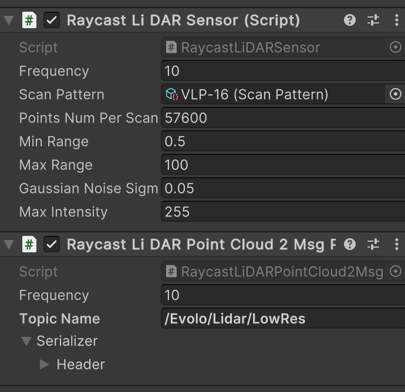


You should run either one at a time or none of them. You should not, at this moment, run more than one Lidar simultaneously.

The Lidars are heavy to run, so you should consider if your application needs a higher resolution Lidar. The default is the lower resolution 16 channel Lidar.

These LiDARs publish ROS topics whose names can be altered in their GameObject's sensor. Currently they use the /Evolo namespace. **⚠️ IMPORTANT: If you are going to use them in another vehicle, change this namespace manually to the name of your vehicle.** This is different in comparisson to other sensors in this simulator.

Each of these LiDARs publishes to a different ROS topic. For now, this is the appropriate way of doing it, so you do not have more than one publisher for the same topic.

These LiDARs are all attached to the `lidar_link`, which defines their pose.

### Sensors
This prefab has the following sensors:
- **GPS** (vehicle component sensor that already existed from SAM)
- **IMU** (vehicle component sensor that already existed from SAM)
- **Onboard camera** (vehicle component sensor that already existed from SAM)
- **TF** (vehicle component sensor that already existed from SAM)
- **LiDAR** sensors from [UnitySensor and UnitySensorRos packages](https://github.com/Field-Robotics-Japan/UnitySensors)
- **SidSideScanSonar** - SSS - (vehicle component sensor that already existed from SAM)

All of the mentioned sensors have a corresponding link that defines their position, similarly to what is done in other SMaRC unity sim vehicles.

#### UnitySensor and UnitySensorRos packages
These packages were included in SMARCUnityHDRP and SMARCUnityStandard. These are open source and use the Apache-2.0 license. They include the following sensors: 
- Velodyne 3D LiDAR (Velodyne VLP-16, VLP-16-HiRes, VLP-32, HDL-32E, VLS-128)
- Livox 3D LiDAR(Avia, Horizon, Mid40, Mid70, Tele, HAP, Mid360)
- RGB Camera
- RGBD Camera
- IMU
- GNSS
- (GroundTruth)
- (TF)

### Evolo's Scene
This prefab is currently used in the `Evolo.unity` scene. 
This scene includes Evolo, several buoys, and randomly moving boats that serve as obstacles. It also includes the same Asko terrain prefab and water that are used in the OneSamOneDroneInAsko scene.
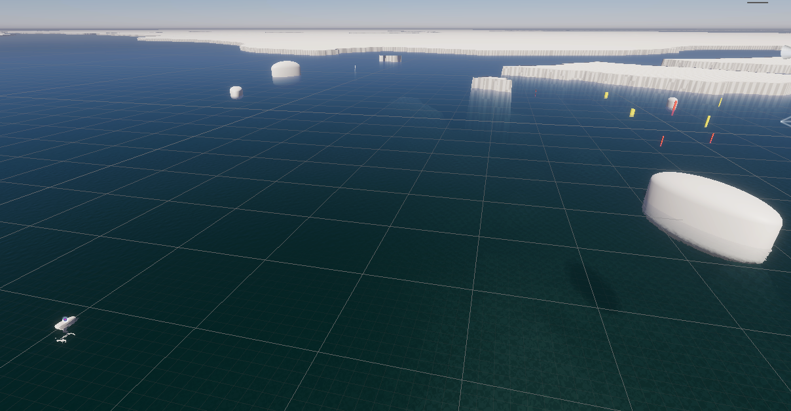


# Developer Environment Setup

## CSharp SDK and LSP Setup
Unity's default C# dotnet package does not come with an SDK. This can impede text editors ability to properly refactor code and provide reference searching and other tasks. Basically it will slow you down.

To alleviate this problem, here is the general process for setting up the dotnet SDK such that code can be efficiently refactored using LSP's (language server protocol).

1. See if `dotnet` is on your path by using a prefered terminal to enter the `dotnet` command
    - If it is not, find the `dotnet` executable and put it in your path or place a link to location in `/usr/bin/`
    - Path usually looks something like this `/home/<user name>/Unity/Hub/Editor/<editor version>/Editor/Data/NetCoreRuntime`
2. Download the appropriate (likely `.NET 9.0`) sdk from [Microsoft Dotnet SDK Link](https://dotnet.microsoft.com/en-us/download)
    - [Dotnet Installation Instruction for Ubuntu 22.04](https://learn.microsoft.com/en-us/dotnet/core/install/linux-ubuntu-install?pivots=os-linux-ubuntu-2204&tabs=dotnet9)
    - **Install the SDK only, the runtime comes prepackaged with Unity**
3. Check to ensure dotnet-sdk installed with `dotnet --list-sdks`
    -  Example output: `9.0.100 [/usr/lib/dotnet/sdk]`
4. Restart your editor of choice and should be able to access LSP features
